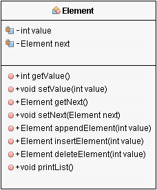
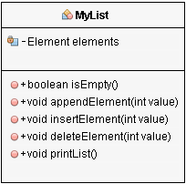

# Aufgabe 9: verkettete Liste

## Thema: verkettete Liste mit null-Referenz

# Aufgabenstellung

###Chckliste
- [ ] Alle Element-Methoden implementiert
- [ ] Alle MyList-Methoden implementiert
- [ ] Die 4 Situtationstest für MyList implementiert 

Ladet euch die zwei Klassen zum Abbilden einer verketteten Liste herunter.

Die Klassen `Element` und `MyList` wurden im Tutorium mit folgenden Attributen und Methoden vorgestellt:

Implementiert in der der Klasse `Element` folgende rekursiv arbeitende Methoden (gekennzeichnet mit @todo):

- `int size()` Liefert die Anzahl der Elemente.
- `int sum()` Liefert die Summe der Werte dieses und aller folgenden Elemente.
- `boolean isSorted()` Liefert true, wenn kein Element folgt oder die folgenden Elemente jeweils keinen kleineren Wert enthalten als ihr Vorgänger.
- `boolean existsElement(int value)` Liefert true, wenn dieses oder eines der folgenden Elemente den übergebenen Wert enthält.
- `String showValues()` Liefert einen String mit diesem Wert und jeweils durch ein Leerzeichen getrennt alle folgenden Werte. Um einen Integer-Wert in einen String zu wandeln, kann man String.valueOf(value) benutzen, oder die implizite Wandlung mit "" + value verwenden.
- `int getValueAt(int index)` Liefert den Wert des Elements an der Stelle x (Zählung beginnt bei 0). Wurde ein falscher Index angegeben, wird Integer.MAX_VALUE zurückgegeben.
- `Element insertElementAt(int value, int index)` Fügt ein neues Element mit dem übergebenen Wert an der Stelle index ein. Wird als Index die Arraylänge übergeben, so wird das neue Element angehängt. Wurde ein falscher Index übergeben, so wird das Element und die folgenden unverändert zurückgegeben.
- `Element insertElementAtFront(int value)` Fügt ein neues Element mit dem übergebenen Wert vor das aktuelle Element ein.

Implementiert in der Klasse `MyList` folgende Methoden (gekennzeichnet mit @todo):

- `int size()` Liefert die Anzahl der Listenelemente
- `int sum()` Liefert die Summe aller in der Liste enthaltenen Werte
- `boolean isSorted()` Liefert true, wenn die Liste aufsteigend sortiert ist
- `boolean existsElement(int value)` Liefert true, wenn bereits ein Element mit diesem Wert in der Liste enthalten ist.
- `String showValues()` Liefert einen String, der umschlossen von geschweiften Klammern die in der Liste enthaltenen Werte (jeweils durch ein Leerzeichen getrennt) darstellt.
- `int[] getValues()` Liefert ein Array mit den enthaltenen Werten.
- `int getValueAt(int index)` Liefert den Wert an der Stelle index. Ist der Index ungültig, so wird Integer.MAX_VALUE zurückgegeben.
- `void insertElementAt(int value, int index)` Fügt ein Element mit dem Wert value an der Stelle index ein. Ist der Index ungültig, bleibt die Liste unverändert.
- `void insertElementAtFront(int value)` Fügt ein Element mit dem Wert value an den Anfang der Liste
- `void insertSortedIfUnique(int value)` Fügt ein Element mit dem Wert value vor dem ersten Element mit einem größeren Wert ein, wenn noch kein Element mit diesem Wert vorhanden ist. Sonst bleibt die Liste unverändert.

Zudem befinden sich im Projekt zwei Testdateien.

Während `ElementTest` komplett vorgegeben ist, prüft `MyListTest` nur die vorgestellten Methoden. Implementiert also zunächst die Klasse `Element` und testet diese. Setzt dann die geforderten Methoden in `MyList` um. Beachtet bei den herausgegebenen Tests für `MyList` die Abhängigkeiten: Beispielsweise `MyListTest.testInsertElement_AtFront()` benötigt fehlerfreie `MyList.appendElement()`, `Mylist.size()` und `MyList.getValues()`. 

Alle herausgegebenen Tests müssen bei der Abnahme erfolgreich sein!

Mit eigenen Testmethoden könnt Ihr die Funktionalität der Methoden in `MyList` überprüfen.

Ihr müsst noch folgende 4 Situationstests erstellen:

- `testListOfThree()` -  prüft eine Liste mit den enthaltenen Werten {1, 2, 5}
- `testListWithDoubleValues()` - prüft die Liste {1, 2, 2, 3}
- `testListUnsortedAtBegin()` - prüft {2, 1, 3}
- `testListEmpty()` - prüft eine Liste ohne Elemente {}

Die Situationstests sollen die folgenden Erwartungen an MyList formulieren:
- ist leer
- ist sortiert
- Listenlänge
- Summe der Werte
- existiert der Wert x für alle vorhandenen Werte und mindestens einen nicht vorhandenen Wert
- `getValueAt()` für jeden vorhandenen Index und mindestens einen falschen Index.

Zu verwenden sind `assertTrue()`, `assertFalse()`, `assertEquals()` und `assertArrayEquals()`. Wendet `assertEquals()` nicht auf Referenzen an, sondern nur auf Werte.

## Hilfe

Versucht mal, Euch keine Anregungen aus dem Internet zu holen. Es gibt sehr viele Wege, eine Liste zu implementieren. Die hier geforderte Variante ist selten zu finden und das Verstehen der anderen Varianten noch nicht hilfreich. Haltet Euch somit an die im Tutorium erklärten Beispiele.

**Viel Erfolg!**